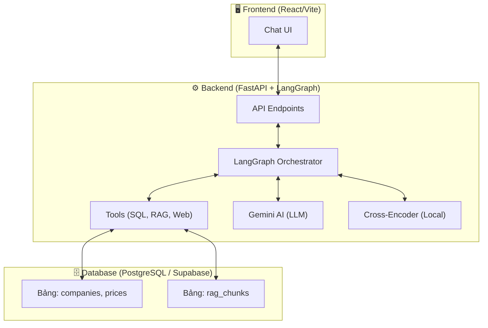
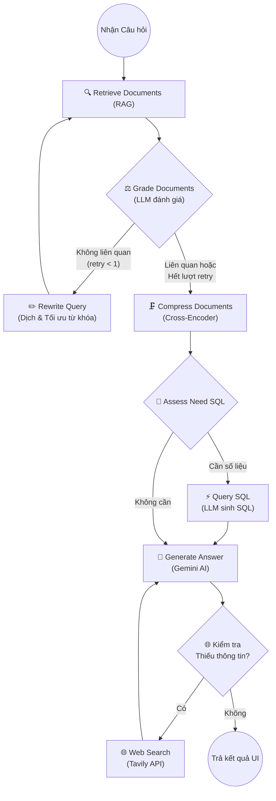

# 📘 Báo cáo Kiến trúc & Luồng xử lý Hệ thống Agentic Finance

Tài liệu này tổng hợp toàn bộ kiến trúc, luồng chạy, các chức năng và kỹ thuật áp dụng trong dự án Agentic Finance (Chatbot AI Tài chính). Bạn có thể sử dụng nội dung này để viết báo cáo đồ án hoặc thuyết trình.

## 1. Kiến trúc Tổng thể (Architecture)

Hệ thống được thiết kế theo kiến trúc Microservices / Client-Server, bao gồm các thành phần chính:

*   **Frontend (UI):** React + Vite. Giao diện Chat trực quan.
*   **Backend (API & AI):** FastAPI (Python) cung cấp API, thư viện LangGraph đóng vai trò làm công cụ điều phối (Orchestrator) các Agent.
*   **Database:** PostgreSQL (hiện tại dùng Supabase). Lưu trữ cả dữ liệu cấu trúc (thông tin công ty, giá cổ phiếu) và dữ liệu phi cấu trúc (các đoạn văn bản báo cáo cho RAG).
*   **LLM Engine:** Gemini AI. Đảm nhiệm việc suy luận, sinh SQL, phân tích ngữ nghĩa, đánh giá tài liệu và tạo câu trả lời tự nhiên.

---

## 2. Luồng Thu thập & Xử lý Dữ liệu (Data Pipeline)

Luồng chuẩn bị dữ liệu (Data Ingestion) được chia làm 2 nhánh rõ rệt phục vụ cho 2 tính năng chính.

### 2.1. Nhánh dữ liệu định lượng (Stock Prices/SQL)
*   **File xử lý:** Nằm trong file Jupyter Notebook `scripts/download_30_companies.ipynb`.
*   **Cách hoạt động:** Dữ liệu lịch sử giá cổ phiếu và thông tin cơ bản của 30 công ty thuộc nhóm DJIA (Dow Jones) được thu thập tự động (từ Yahoo Finance). Sau đó dữ liệu được làm sạch và đẩy thẳng vào 2 bảng `companies` và `prices` trong PostgreSQL để phục vụ cho các truy vấn bằng SQL.

### 2.2. Nhánh dữ liệu định tính (RAG - Báo cáo SEC 10-K)
Toàn bộ tài liệu văn bản (Báo cáo thường niên SEC 10-K của Mỹ) định dạng HTML trải qua một Pipeline 3 bước tự động:
1.  **Extract (Trích xuất văn bản):** Script `parse_html_docs.py` đọc toàn bộ file HTML, lược bỏ các thẻ `<script>`, `<style>`, chỉ giữ lại văn bản thô (plain text).
2.  **Clean (Làm sạch rác):** Script `clean_rag_txt.py` dùng Regular Expressions (Regex) xóa bỏ các thông tin rác (thẻ chuẩn kế toán XBRL, URL dài, CIK code). Hệ thống cũng thông minh bỏ qua phần dạo đầu pháp lý của SEC và chỉ bắt đầu lấy nội dung từ các mục quan trọng như *Risk Factors (Rủi ro)*, *Business (Tổng quan)*, *MD&A (Thảo luận của Ban Giám đốc)*.
3.  **Chunk & Load (Chia nhỏ và Lưu DB):** Script `chunk_docs.py` chia văn bản dài thành các khối (chunks) khoảng 1800 ký tự (overlap/gối đầu nhau 250 ký tự để không mất ngữ cảnh chéo). Script tự động gán nhãn phần (section) cho chunk và chèn hàng loạt (batch-insert) vào bảng `rag_chunks`.

---

## 3. Luồng Xử lý Trí tuệ Nhân tạo (LangGraph Flow)

Trái tim của hệ thống AI không phải là một chuỗi tuần tự thông thường mà là một **State Graph** (Đồ thị trạng thái) sử dụng LangGraph. Đồ thị này định nghĩa một luồng xử lý thông minh dựa trên kỹ thuật **Corrective RAG (CRAG)** kết hợp **Self-Reflection**.

**Chi tiết các bước thực thi (Các Nodes tương ứng trong file `backend/nodes.py`):**
1.  **Retrieve Documents:** Nhận diện tên công ty trong câu hỏi. Dịch sơ bộ các từ khóa tài chính tiếng Việt sang tiếng Anh (Vd: *doanh thu -> revenue*). Tìm kiếm mức độ liên quan (Relevance) trong database bằng SQL Keyword Search/Vector.
2.  **Grade Documents:** LLM đóng vai trò người giám định (Grader), đọc lướt tài liệu vừa tìm được xem có khả năng trả lời câu hỏi không (trả về Yes/No).
3.  **Rewrite Query:** Lặp lại 1 lần duy nhất nếu tài liệu bị đánh giá là rác. LLM sẽ tự động dịch hoặc viết lại câu hỏi rõ nghĩa hơn bằng tiếng Anh để đi tìm lại (Self-Correction).
4.  **Compress Documents:** Kỹ thuật thu gọn ngữ cảnh. Dùng mô hình AI nhỏ ở local (`ms-marco-MiniLM-L-6-v2`) chấm điểm từng câu trong chunk. Dù chunk có 1800 ký tự, thuật toán chỉ rút trích ra **3 câu** sát nghĩa với câu hỏi nhất.
5.  **Assess & Query SQL:** Node định tuyến kiểm tra xem câu hỏi có mang tính định lượng không (hỏi giá, khối lượng). Nếu có, LLM sẽ tự động viết câu lệnh SQL dựa trên Schema DB được cấp sẵn và truy xuất thẳng vào DB.
6.  **Generate Answer:** Tổng hợp toàn bộ dữ liệu (tài liệu đã nén, bảng SQL đã query). Gemini sẽ biên soạn câu trả lời cuối cùng bằng ngôn ngữ tự nhiên tiếng Việt, format dễ nhìn và luôn trích dẫn nguồn.
7.  **Web Search:** Tích hợp Tavily API làm dự phòng. Nếu dữ liệu nội bộ trống, hệ thống chạy ra ngoài Internet để tra cứu.

---

## 4. Các kỹ thuật tiên tiến (Advanced AI Techniques)

Khi đi báo cáo/bảo vệ đồ án, bạn nên đặc biệt nhấn mạnh vào **5 điểm "ăn tiền"** sau đây của hệ thống:

1.  **Agentic Workflow (Luồng Tác tử tự chủ):** Khác biệt hoàn toàn với chatbot thế hệ cũ (Rule-based) hay một chuỗi RAG đơn giản thẳng tuột. Nhờ **LangGraph**, hệ thống Agent này có tính "tự chủ" (Agentic): Tự quyết định khi nào cần tìm RAG, khi nào rẽ nhánh viết SQL, tự biết quay lại (loop) để tìm tài liệu nếu thấy kết quả ban đầu kém.
2.  **Corrective RAG (CRAG) & Self-Correction:** Khắc phục triệt để điểm yếu "Garbage in, Garbage out" của hệ thống RAG cơ bản. Bằng việc chèn một bước đánh giá (Grade) ở giữa, AI có khả năng "tự nhận thức" là mình đang cầm tài liệu rác và chủ động cấu trúc lại truy vấn (Rewrite) để đi tìm kết quả tốt hơn.
3.  **Context Compression (Cross-Encoder Re-ranking):** Nỗi ám ảnh của RAG là nhét quá nhiều tài liệu dài vào Context khiến LLM bị "ảo giác" (Hallucination) và tốn chi phí Token. Hệ thống này chia nhỏ (Chunking) chưa đủ, mà còn dùng **Cross-Encoder** nén tài liệu ở cấp độ câu (Sentence-level). Chỉ lấy 3 câu tinh túy nhất đưa cho LLM tổng hợp.
4.  **Multilingual RAG (Xử lý Đa ngôn ngữ):** Giải quyết một bài toán vô cùng thực tế: *User hỏi bằng Tiếng Việt nhưng kho tri thức (Báo cáo SEC) là Tiếng Anh*. Hệ thống xử lý thông minh qua cơ chế mapping từ khóa từ điển và Rewrite dịch ngầm sang tiếng Anh trước khi đụng vào Data, nhưng bước cuối (Generate) vẫn ép LLM trả ra kết quả bằng văn phong tiếng Việt chuẩn.
5.  **Text-to-SQL (NL2SQL):** Cho phép người dùng truy vấn một bảng dữ liệu đồ sộ 15,000 dòng lịch sử giá chứng khoán chỉ bằng ngôn ngữ tự nhiên, không cần biết code.

---

## 5. Chức năng chi tiết từng File mã nguồn

### Thư mục Backend (`/backend`)
*   `main.py`: Điểm vào (Entrypoint) của Server FastAPI. Định nghĩa các API Endpoints (như `/chat`), nhận Request từ Frontend (UI), gọi hệ thống LangGraph chạy và trả JSON về.
*   `graph.py`: Định nghĩa bản đồ luồng chạy (StateGraph). Vẽ đường đi, kết nối các Nodes (hàm xử lý) và Edges (điều kiện rẽ nhánh/if-else) lại với nhau tạo thành luồng Agent hoàn chỉnh.
*   `nodes.py`: Trái tim của Logic. Chứa cụ thể nội dung các hàm tương ứng với sơ đồ (Hàm Retrieve, Hàm Grade, Hàm Rewrite, Hàm Compress, Query SQL, Generate Answer).
*   `tools.py`: Nơi định nghĩa các "Công cụ" (Tools) cấp cho Agent. Bao gồm kết nối và truy vấn DB PostgreSQL, hệ thống điểm từ khóa RAG Search, hoặc tích hợp Tavily Search API.
*   `llm.py`: File cấu hình, nơi cài đặt API Key, nhiệt độ (Temperature) và khởi tạo kết nối với mô hình Gemini AI.
*   `state.py`: Nơi khai báo `State` (Trạng thái) - cục bộ nhớ trung tâm di chuyển qua tất cả các Node mang theo biến Câu hỏi, Lịch sử Chat, Tài liệu tìm được, Kết quả SQL...

### Thư mục Xử lý Dữ liệu (`/scripts`)
*   `download_30_companies.ipynb`: Script chạy một lần tải dữ liệu giá cổ phiếu định lượng từ Yahoo Finance.
*   `parse_html_docs.py`: Bóc tách thẻ HTML của 30 Báo cáo tài chính thành Text thô.
*   `clean_rag_txt.py`: Chạy Regex làm sạch rác định dạng.
*   `chunk_docs.py`: Chia nhỏ văn bản thành chunk 1800 ký tự và đẩy lên Database PostgreSQL.
