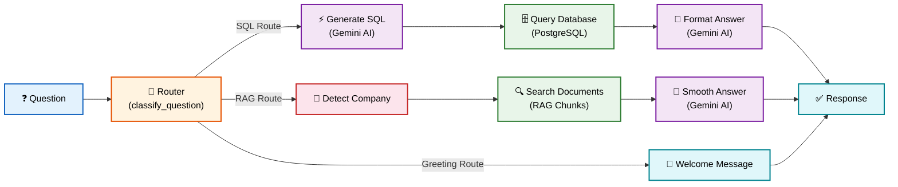
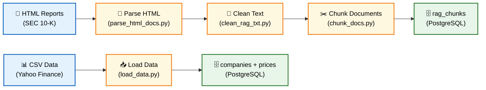
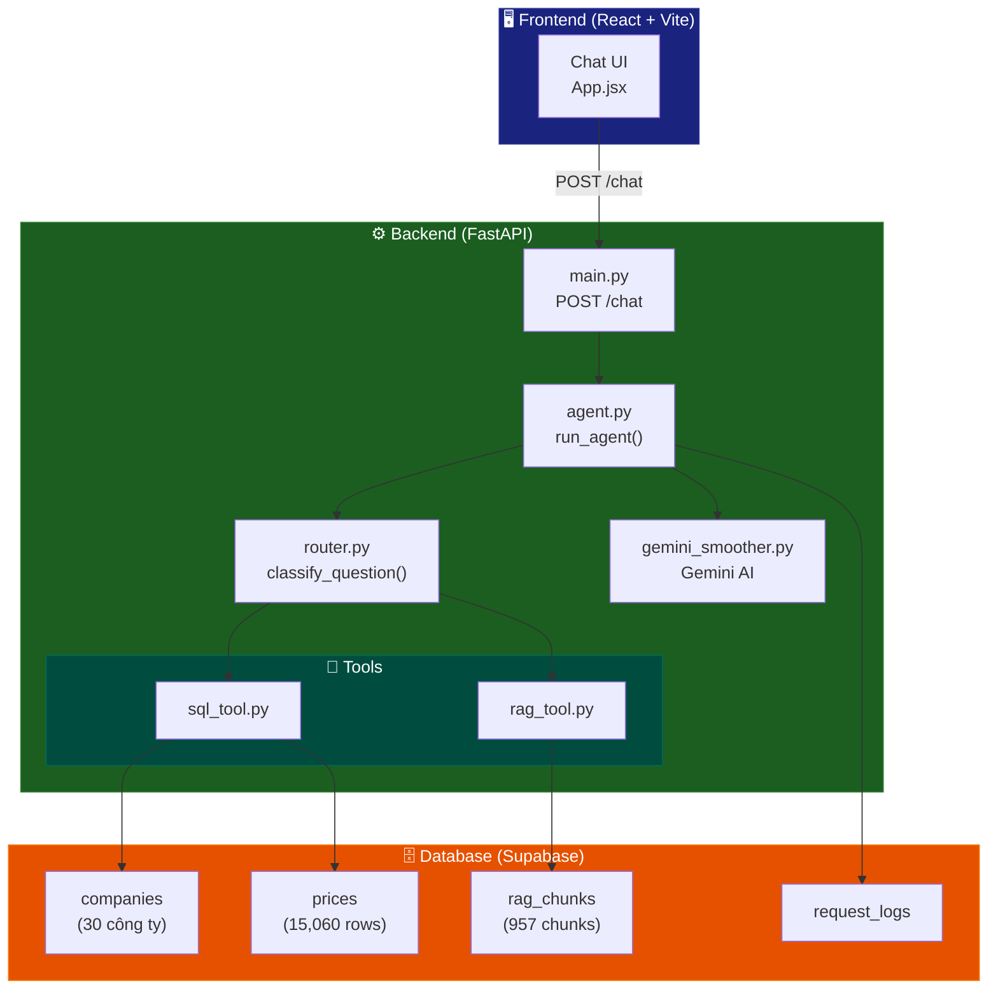

# 📊 Sơ đồ luồng chạy Project Agentic Finance

## 1. Luồng chạy chính (Agent Flow)

---

## 2. Data Pipeline (Tiền xử lý dữ liệu)

---

## 3. Kiến trúc tổng thể

---

## 4. Luồng chi tiết từng bước

| Bước | Component | File | Mô tả |
|------|-----------|------|-------|
| 1 | User nhập câu hỏi | `App.jsx` | Frontend gửi POST request |
| 2 | API nhận request | `main.py` | FastAPI endpoint `/chat` |
| 3 | Phân loại câu hỏi | `router.py` | Keyword-based → `sql`, `rag`, hoặc `greeting` (Hỗ trợ từ khóa tiếng Việt) |
| 4a | **SQL**: Sinh SQL | `agent.py` | Gemini AI sinh câu SQL. Có tích hợp **Fallback SQL** dự phòng khi LLM quá tải (nhận diện cao nhất/thấp nhất, khối lượng/giá). |
| 4b | **RAG**: Tìm company | `rag_tool.py` | Detect company từ câu hỏi |
| 4c | **Greeting**: Xử lý | `agent.py` | Trả về lời chào thân thiện |
| 5a | **SQL**: Truy vấn DB | `sql_tool.py` | Chạy SQL trên PostgreSQL |
| 5b | **RAG**: Tìm chunks | `rag_tool.py` | Tìm chunks phù hợp trong DB |
| 6 | Format câu trả lời | `agent.py` / `gemini_smoother.py` | Gemini viết lại bằng tiếng Việt (Hoặc Fallback RAW nếu lỗi) |
| 7 | Ghi log | `agent.py` | Lưu vào `request_logs` |
| 8 | Trả kết quả | `main.py` → `App.jsx` | JSON response → hiển thị chat |

